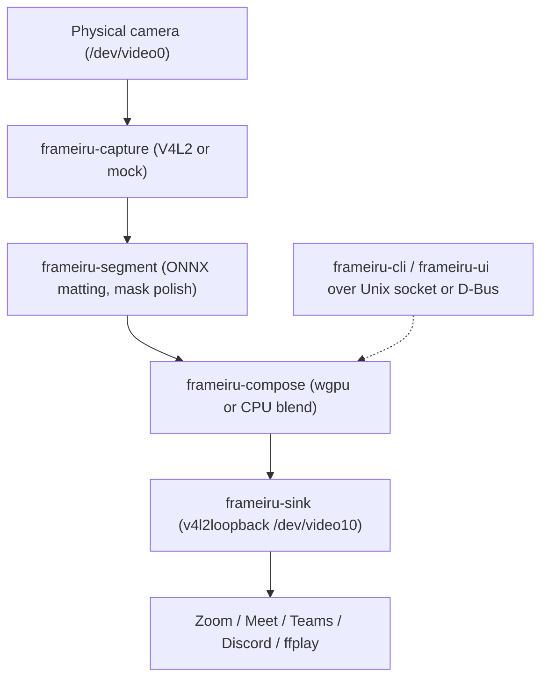

# Frameiru

Real-time Linux virtual webcam with background blur and replacement, written in Rust.

Frameiru reads your physical camera, computes a foreground mask with an embedded neural
matting model, composites a new background, and publishes the result to a
[`v4l2loopback`](https://github.com/umlaeute/v4l2loopback) device that Zoom, Google Meet,
Teams, Discord, `ffplay`, or anything else can select as a regular webcam.

- **Zero-setup segmentation** — a fused MediaPipe Selfie + RVM MobileNetV3 matting model
  ships inside the binary; no model download required. External ONNX models are supported.
- **Dynamic backgrounds** — passthrough, blur, solid color, image, or looping video,
  switchable at runtime without restarting the camera stream.
- **GPU or CPU compositing** — wgpu pipeline with automatic fallback to a rayon CPU path.
- **Built for real-time** — decoupled capture/inference/composite threads, motion-aware
  inference gating, frame dropping for bounded latency, preview tap, and live metrics.
- **CLI, daemon, and GUI** — foreground runner, background daemon with a Unix-socket
  control plane and optional D-Bus, plus a Slint desktop app.

## Contents

- [How it works](#how-it-works)
- [Requirements](#requirements)
- [Quick start](#quick-start)
- [Backgrounds](#backgrounds)
- [CLI reference](#cli-reference)
- [Desktop GUI](#desktop-gui)
- [Library use](#library-use)
- [Workspace layout](#workspace-layout)
- [Feature flags](#feature-flags)
- [Tuning](#tuning)
- [Testing](#testing)
- [Troubleshooting](#troubleshooting)
- [Related tools](#related-tools)
- [Documentation](#documentation)
- [License](#license)

## How it works



The pipeline engine runs capture, inference, and composition on separate threads connected
by bounded channels:

- Frames that don't fit in a channel are dropped (newest dropped), so latency stays bounded
  when a stage falls behind.
- Inference is gated: static scenes skip segmentation entirely, and motion overrides the
  rate cap at half the interval.
- The compositor can reuse the previous composite for idle frames while still feeding the
  sink, keeping output FPS stable when only the background changes.
- A preview broadcast channel lets the GUI display frames without touching the hot path.

## Requirements

- Linux with V4L2 support.
- A recent stable Rust toolchain (**1.87+**; the code uses `is_multiple_of` and other
  recently stabilized APIs).
- The `v4l2loopback` kernel module for the virtual camera output.
- `ffmpeg` and `ffprobe` on `PATH` only if you use `video:<path>` backgrounds (probed at
  open time, so failures surface immediately).
- The `onnx` feature downloads ONNX Runtime binaries at build time via the `ort` crate
  (`download-binaries`). No system ONNX Runtime install is needed.

## Quick start

### 1. Build

```sh
cargo build --release -p frameiru-cli --features full
# binary: target/release/frameiru-cli
```

### 2. Load v4l2loopback

```sh
sudo modprobe v4l2loopback exclusive_caps=1 card_label="Frameiru"
```

`exclusive_caps=1` makes the device show up as a camera (not a capture device) for
consumers; start the pipeline before opening the camera in the consuming app.

### 3. Run the pipeline

```sh
# Foreground, with a control socket for live changes:
frameiru-cli run --background blur:8 --socket /tmp/frameiru.sock

# Or as a detached daemon (log: <socket>.log, pid: <socket>.pid):
frameiru-cli start --socket /tmp/frameiru.sock
frameiru-cli status --socket /tmp/frameiru.sock
frameiru-cli set-bg color:0,120,0 --socket /tmp/frameiru.sock
frameiru-cli stop --socket /tmp/frameiru.sock
```

No model flag needed: the embedded fusion model (MediaPipe Selfie anchor ∪ RVM matting,
256x256, unit normalization) is compiled into the binary and provides masks out of the box.

### 4. Select the camera

In your video app, pick **Frameiru** (or `/dev/video10`) as the camera. Verify from the
terminal with:

```sh
ffplay -f v4l2 -input_format yuyv422 -video_size 640x480 -i /dev/video10
```

No camera or kernel module at hand? Smoke-test the whole engine hermetically:

```sh
frameiru-cli run --mock --null-sink --background blur:8
frameiru-cli benchmark --frames 300
```

## Backgrounds

The `--background` / `set-bg` argument accepts:

| Syntax               | Effect                                              |
| -------------------- | --------------------------------------------------- |
| `passthrough`        | Zero-cost bypass; the source frame is untouched.    |
| `blur:<radius>`      | Blur the background; radius in `1..=30` pixels.     |
| `color:<r,g,b>`      | Replace the background with a solid RGB color.      |
| `image:<path>`       | Replace the background with a still image.          |
| `video:<path>`       | Replace with a looping video (requires `ffmpeg`).   |

## CLI reference

| Command                     | Purpose                                                            |
| --------------------------- | ------------------------------------------------------------------ |
| `run [OPTIONS]`             | Run the pipeline in the foreground (Ctrl-C shuts down cleanly).    |
| `start [OPTIONS]`           | Launch `run` as a detached daemon with a socket, log, and pid file.|
| `stop [--socket PATH]`      | Stop a running pipeline through its control socket.                |
| `status [--socket PATH]`    | Print FPS, latency, mask counts, and the active background.        |
| `set-bg BG [--socket PATH]` | Change the background of a running pipeline.                       |
| `devices`                   | List V4L2 capture and loopback devices.                            |
| `inspect <DEVICE>`          | Print a device's formats and available resolutions.                |
| `benchmark [OPTIONS]`       | Throughput/latency numbers without a video sink.                   |

Common `run`/`start` options:

```text
--device /dev/video0     capture device
--output /dev/video10    loopback output device
--width 640 --height 480 capture resolution
--max-fps 30             composited frames per second (0 = uncapped)
--background BG          see table above
--socket PATH            start the IPC server (required for stop/status/set-bg)
--mock                   synthetic test-pattern source instead of a camera
--null-sink              discard composited frames instead of writing loopback
--model PATH             external ONNX model (overrides the embedded default)
--input-size 256x256     ONNX input canvas: 256x256 RVM, 320x320 u2net/silueta,
                         1024x1024 isnet/BiRefNet/rmbg-2.0
--normalization S        imagenet (default for external models) or unit (MediaPipe)
--threads N              ORT intra-op threads; default pins to physical core count
--infer-fps 30           segmentation rate cap (0 = every frame)
--mask-alpha off         mask EMA smoothing: off, or 0.0 (freeze) ..= 1.0 (none)
--mask-contrast 0.4      soft mask threshold center; off disables
--mask-dilate 0          foreground dilation in pixels
--subject-light 0        lift the masked subject toward white, 0..1
--roi-zoom               dynamic crop & track around the subject
--no-refine-mask         disable guided-filter edge refinement (on by default)
```

Model loading auto-detects RVM-style recurrent graphs (5+ inputs) versus plain
single-input models, so `isnet`, `silueta`, `u2net`, `rmbg-2.0`, and friends work when
given the right `--input-size` and `--normalization`.

The control socket defaults to `$XDG_RUNTIME_DIR/frameiru.sock`, falling back to
`/tmp/frameiru-<pid>.sock`. Pass an explicit `--socket` (or ensure `XDG_RUNTIME_DIR` is
set) so `stop`/`status`/`set-bg` resolve the same path as the daemon.

The wire protocol is newline-delimited JSON with three requests — `set_background`,
`get_status`, and `stop` — so scripts can talk to the socket directly.

`start` forwards the core flags (`--device`, `--output`, `--width`, `--height`,
`--background`, `--max-fps`, `--socket`, `--mock`, `--null-sink`, `--model`); use `run` in
the foreground for the full tuning set.

## Desktop GUI

```sh
cargo run -p frameiru-ui -- --model /path/to/model.onnx --input-size 320x320
```

The Slint app (default features: `gpu`, `v4l2`, `onnx`) detects cameras, starts/stops the
pipeline, shows a live preview, and provides runtime controls:

- Background modes: passthrough, blur, color, and image picker.
- Full-frame overlay effects: scanlines, light leak, and CRT.
- Webcam controls (brightness, contrast, and vendor controls for supported devices).

Without a loopback device the GUI falls back to headless preview; without `--model` it
uses the embedded fusion model.

## Library use

The engine is headless-friendly and embeds in any Rust application:

```rust
use frameiru_compose::new_compositor;
use frameiru_pipeline::{Engine, PipelineConfig};
use frameiru_core::BackgroundMode;

let engine = Engine::start(
    PipelineConfig { max_fps: 30, ..Default::default() },
    source,      // Box<dyn FrameSource>: V4l2Source, MockSource, ...
    segmenter,   // Option<Box<dyn Segmenter>>: load_embedded, load_model, ...
    compositor,  // Box<dyn Compositor>: new_compositor() picks GPU or CPU
    sink,        // Box<dyn FrameSink>: LoopbackSink, MockSink, ...
)?;

let handle = engine.handle();
handle.update_background(BackgroundMode::Blur { radius: 8.0 })?;
handle.update_overlay(frameiru_core::OverlayMode::Crt)?; // GUI-style effects
let metrics = handle.metrics();
handle.shutdown();
```

Trait boundaries live in `frameiru-core` ([`FrameSource`], [`Segmenter`], [`Compositor`],
[`FrameSink`]), so stages can be swapped or mocked in tests.

## Workspace layout

| Crate                   | Role                                                                                     |
| ----------------------- | ---------------------------------------------------------------------------------------- |
| `frameiru-core`         | Primitives: pixel formats, resolutions, buffer pooling, masks, background/overlay modes, traits, errors. |
| `frameiru-capture`      | Frame sources: V4L2 device streaming, synthetic mock source, YUYV/MJPEG decoding.        |
| `frameiru-segment`      | ONNX segmentation: letterboxing, model runner, fusion segmenter, guided-filter refinement, mask polish, temporal smoother, ROI tracking. |
| `frameiru-compose`      | Compositing: rayon CPU blender, wgpu GPU blender, looping video backgrounds.             |
| `frameiru-sink`         | Outputs: v4l2loopback writer, preview broadcast, mock sink, RGB→YUYV conversion.         |
| `frameiru-ipc`          | Control plane: Unix-socket JSON server/client and optional D-Bus service.                |
| `frameiru-pipeline`     | Engine: worker threads, pacing, motion gating, metrics, preview tap, clean shutdown.     |
| `frameiru-cli`          | `frameiru-cli` binary: run/start/stop/status/set-bg/devices/inspect/benchmark.           |
| `frameiru-ui`           | `frameiru-ui` binary: Slint desktop GUI.                                                 |
| `frameiru-webcam-utils` | `frameiru-webcam-utils` binary: Anker PowerConf C200 vendor UVC controls (see [its README](crates/frameiru-webcam-utils/README.md)). |

## Feature flags

Everything is off by default so headless/CI builds stay dependency-free; enable what you
need per crate, or use `frameiru-cli --features full`.

| Crate                            | Feature  | Effect                                                                 |
| -------------------------------- | -------- | ---------------------------------------------------------------------- |
| `frameiru-cli`                   | `full`   | `gpu` + `onnx` + `v4l2` + `dbus` (default: none).                      |
| `frameiru-capture`               | `v4l2`   | Real device streaming (self-contained; no system libv4l needed).       |
| `frameiru-capture`               | `mjpeg`  | Hardware MJPEG decode via pure-Rust `zune-jpeg`.                       |
| `frameiru-sink`                  | `v4l2`   | v4l2loopback virtual device writer.                                    |
| `frameiru-segment`               | `onnx`   | `ort` inference (downloads ONNX Runtime at build time).                |
| `frameiru-compose`               | `gpu`    | wgpu compositor with automatic CPU fallback.                           |
| `frameiru-ipc`                   | `dbus`   | D-Bus service via `zbus`.                                              |
| `frameiru-core`                  | `slint`  | Zero-copy conversion to `slint::SharedPixelBuffer`.                    |
| `frameiru-core`                  | `serde`  | Serialization for the IPC protocol.                                    |
| `frameiru-ui`                    | —        | Defaults to `gpu`, `v4l2`, `onnx`.                                     |

## Tuning

- **Inference dominates cost.** `--infer-fps 30` plus motion gating already skips static
  scenes; lower `--infer-fps` further on constrained CPUs.
- **Threads**: ORT defaults to the physical core count (logical cores rarely help latency
  and heat the CPU). Use `--threads 2..4` on constrained machines.
- **Mask quality**: guided-filter refinement (`--no-refine-mask` disables, ~2–3 ms at
  640x480), `--mask-contrast` to collapse ghosting mid-alphas, `--mask-dilate` to grow
  the subject slightly and stop background leaking at the matte edge.
- **`--mask-alpha` is off by default** for instant motion tracking; enable it to trade
  trailing blur for temporal stability on low inference rates.
- **`--roi-zoom` is off by default** — cropping to a tracking box adds delay and clips at
  boundaries during rapid movement.
- **`--subject-light`** lifts the foreground toward white so the subject looks lit without
  touching the background.

The research notes behind these choices are in
[docs/research/Real-Time Background Blur Optimization.md](docs/research/Real-Time%20Background%20Blur%20Optimization.md)
and [PLAN.md](PLAN.md) (section 9).

## Testing

```sh
# Default matrix (no cameras, no kernel module, no ONNX Runtime download):
cargo test --quiet

# Everything, including ONNX inference tests (build downloads ONNX Runtime):
cargo test --quiet --workspace --all-features

# Targeted crates:
cargo test --quiet -p frameiru-pipeline
cargo test --quiet -p frameiru-segment --features onnx

# Hardware roundtrip: physical camera -> segmentation -> compositing ->
# v4l2loopback -> read back the virtual camera. Skips cleanly without devices.
cargo test -p frameiru-sink --features v4l2 --test passthrough -- --nocapture
```

Lint and format gates:

```sh
cargo fmt --check
cargo clippy --workspace --all-targets --all-features
```

## Troubleshooting

- **`/dev/video10` does not exist** — load the module:
  `sudo modprobe v4l2loopback exclusive_caps=1 card_label="Frameiru"`. Confirm with
  `v4l2-ctl --list-devices`.
- **The consuming app doesn't list Frameiru as a camera** — `exclusive_caps=1` is
  required for camera (not capture) semantics; start the pipeline first, then open the
  app's camera picker.
- **`cannot open capture device` / permission denied** — make sure your user is in the
  `video` group (re-login after changing it) and no other process holds the camera.
- **`stop`/`status` cannot connect** — the daemon and the control command must resolve the
  same socket path; pass `--socket` explicitly or set `XDG_RUNTIME_DIR`.
- **`video:` background fails** — install `ffmpeg`/`ffprobe` and make sure they are on
  `PATH`.
- **GPU compositor unavailable** — wgpu init failures (headless session, driver issues)
  log a warning and fall back to the CPU compositor; this is expected and correct.

## Related tools

The workspace also contains `frameiru-webcam-utils`, a CLI for Anker PowerConf C200
vendor-only controls (FOV preset, HDR, flips, anti-flicker). See
[crates/frameiru-webcam-utils/README.md](crates/frameiru-webcam-utils/README.md).

## Documentation

- [HL.md](HL.md) — high-level architecture sketch.
- [PLAN.md](PLAN.md) — implementation plan and technical specification.
- [docs/e2e.md](docs/e2e.md) — hardware end-to-end verification procedure.
- [docs/research/Real-Time Background Blur Optimization.md](docs/research/Real-Time%20Background%20Blur%20Optimization.md)
  — design research on matting models and pipeline optimization.
- [AGENTS.md](AGENTS.md) — coding and review standards for this repository.

## License

Apache-2.0; see [LICENSE](LICENSE). The workspace manifest declares
`MIT OR Apache-2.0` for the published crates.
